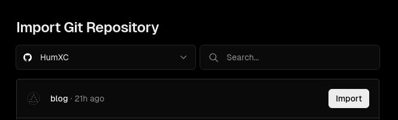
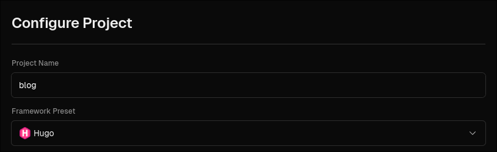
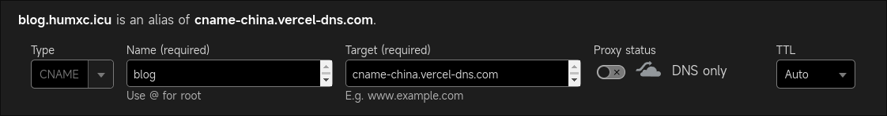

> Hugo is the world’s fastest framework for building websites :)
> _[gohugo.io](https://gohugo.io/)_

This article introduces a method to deploy Hugo to [Vercel](https://vercel.com/).

Deploying Hugo with Vercel has the following advantages:

- It's free.
- If you have your own domain, a simple configuration allows your blog to be accessible inside mainland China.
- Extremely convenient — after deployment, you only need to push articles to GitHub, and Vercel updates the site in about 30 seconds.

However, the official Hugo [Deploy guide](https://gohugo.io/hosting-and-deployment/hugo-deploy/) does not include a tutorial for Vercel. If you also want to deploy your Hugo blog to Vercel, this article may help.

## Preparation

1. If you're new to Hugo, first read the [official quick start guide](https://gohugo.io/getting-started/quick-start/) and try deploying it locally. This article won't go into too much detail.
2. Sign up and log in to [Vercel](https://vercel.com/).
3. Make sure `git`, `hugo`, and `go` are installed on your system.

If you want to quickly create a blog, see the sidebar: [Create a blog based on Stack's exampleSite](#bonus-create-a-blog-based-on-stacks-examplesite)  
If you already have a blog and just need to deploy it, skip directly to [Deploy to Vercel](#deploy-to-vercel)

First, create an empty folder and open a terminal in it.

## Create a Hugo Site

```bash
hugo new site .
```

This will generate a bunch of files and folders. The most important one is `hugo.toml`, which contains Hugo's configuration. If you don't like TOML, you can convert it to YAML or JSON.

Next, enable Hugo modules (we'll use them to install the theme):

```bash
hugo mod init blog
```

Here `blog` is the Go module name.

## Install a Theme

I'm using the [Stack](https://github.com/CaiJimmy/hugo-theme-stack) theme, so add this to `hugo.toml`:

```toml
theme = "github.com/CaiJimmy/hugo-theme-stack/v3"
```

Then run:

```bash
hugo server
```

Visit the address printed in the terminal to preview the theme. The page will look empty at first because the theme still needs configuration — see the [Stack documentation](https://stack.jimmycai.com/). Notably, Stack provides a complete [exampleSite](https://github.com/CaiJimmy/hugo-theme-stack/tree/master/exampleSite) that serves as an excellent starting point. You can also base your own blog directly on that exampleSite.

## Bonus: Create a blog based on Stack's exampleSite

### Note: Start inside an empty folder

```bash
hugo mod init blog          # Enable Hugo modules
git clone https://github.com/CaiJimmy/hugo-theme-stack.git
cp -r hugo-theme-stack/exampleSite/* ./
rm -rf ./hugo-theme-stack
```

Edit `hugo.yaml` (or `hugo.toml`) and change the theme to the module format:

```yaml
theme: github.com/CaiJimmy/hugo-theme-stack/v3
```

Done! Run `hugo server` to preview.

## Deploy to Vercel

### Preparation for Vercel

1. Clean up your blog's Git repository. Add the following to `.gitignore`:

    ```gitignore
    # Don't commit files generated by Hugo
    # We'll let Vercel run Hugo to generate them
    /public
    /resources
    /assets/jsconfig.json
    # Lock file created when Hugo server runs
    /.hugo_build.lock
    ```

2. Create a `vercel.json` file with the following content:

    ```json
    {
      "buildCommand": "hugo --gc --minify --ignoreCache --verbose",
      "installCommand": "yum install golang",
      "build": {
        "env": {
          "HUGO_VERSION": "0.123.4"
        }
      }
    }
    ```

    Make sure `HUGO_VERSION` matches the Hugo version you're using locally.

    Using Hugo modules means you don't need to commit the theme files — they will be fetched during deployment. To enable `hugo mod` support on Vercel, we install Go with `"installCommand": "yum install golang"`. If you're not using modules (i.e., you committed the theme), you can remove that line.

### Deployment

Commit `vercel.json` to Git and push to GitHub.

Go to Vercel.com → New Project → Import your Hugo repository.

In the configuration screen, set **Framework Preset** to **Hugo**.



Click **Deploy** and wait for it to finish.

### Custom Domain

First, you need to own a domain.

Go back to your Vercel dashboard, enter the newly created project, and click **Domains** in the top-left.

For example, with my domain `humxc.icu`, I want to access the blog via `blog.humxc.icu`. Add that subdomain in Vercel.

Then, in your DNS provider, add a record (see Vercel's [common DNS issues guide](https://vercel.com/docs/projects/domains/troubleshooting#common-dns-issues)):

- Either a `CNAME` record pointing to `cname.vercel-dns.com`
- Or an `A` record pointing to `76.76.21.21`

**To make it accessible inside mainland China**, use a `CNAME` pointing to `cname-china.vercel-dns.com` instead, like this:



- If using Cloudflare, turn off **Proxy**.
- If using Alibaba Cloud or Tencent Cloud, look for the "解析线路" (line type) option and select "海外" (overseas) if available.

Back in Vercel, the domain should now show as valid. It may still not be accessible from inside China immediately — wait up to 48 hours.

## NixOS Tip

If you're on NixOS, I wrote a [flake.nix](https://github.com/HumXC/blog/blob/main/flake.nix) that provides a ready-to-use dev shell with Hugo and Go:

```bash
nix develop github:HumXC/blog
```

Works great with `direnv` too.

## Done

Your blog should now be successfully deployed.

Whenever you push updates to GitHub, Vercel will automatically rebuild and redeploy your site. Enjoy! 🚀
