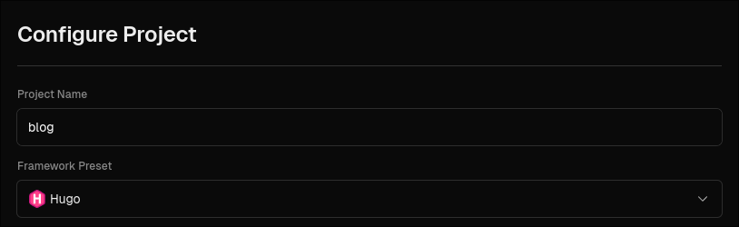
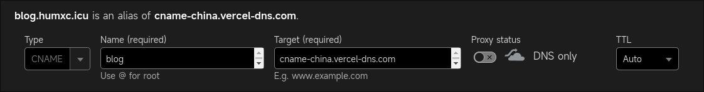

> Hugo 是世界上最快的建站框架 : )  
> The world’s fastest framework for building websites  
> _[gohugo.io](https://gohugo.io/)_

本文介绍一种部署 Hugo 到 [Vercel](https://vercel.com/) 的方法。

使用 Vercel 部署 Hugo 有以下几点好处:

- 白嫖。
- 如果你有自己的域名，简单配置之后可以使博客在墙内也可以访问。
- 方便。部署完成后只需要将文章推送到 Github, Vercel 便能在半分钟内更新。

不过，在 Hugo 的 [Deploy 指导页面](https://gohugo.io/hosting-and-deployment/hugo-deploy/)中并没关于部署到 Vercel 的教程。如果你恰巧也希望通过 Vercel 部署你的 Hugo 博客，那么本文或许对有所帮助。

## 准备工作

1. 如果你没接触过 Hugo, 你应该先看[官方文档](https://gohugo.io/getting-started/quick-start/)，先尝试自己部署。本文并不会提供过多的细节。

2. 注册并登录 [Vercel](https://vercel.com/).

3. 在系统上安装了 git, hugo 和 go。

如果你希望快速创建一个博客，看看 [以 stack 的 examplesite 为基础创建博客](#番外-以-stack-的-examplesite-为基础创建博客)  
如果你已经有一个博客，只差将其部署，则直接跳转到 [部署到-vercel](#部署到-vercel)  
首先准备一个空文件夹，然后在终端打开该文件夹。

## 创建一个 Hugo 项目

```bash
hugo new site .
```

然后会生成一堆文件/文件夹。其中最值得关注的是 hugo.toml 文件，它包含了 Hugo 的配置信息。如果你不喜欢 toml，你也可以将其转化为 yaml 或者 json 格式。

接下来开启 `hugo mod`, 因为我们接下来要使用 `hugo mod` 来安装主题。

```bash
hugo mod init blog
```

其中 `blog` 是 go 的模块名。

## 安装主题

我使用 [Stack](https://github.com/CaiJimmy/hugo-theme-stack) 这个主题，便在 `hugo.toml` 里添加:

```toml
theme = "github.com/CaiJimmy/hugo-theme-stack/v3"
```

然后运行 `hugo server`，访问终端上打印出来的地址，即可看到主题的效果。但是页面空空荡荡，那是因为主题还需要配置，主题的配置见 [stack 的文档](https://stack.jimmycai.com/)。值得一提的是，stack 提供了一个
网站示例 [exampleSite](https://github.com/CaiJimmy/hugo-theme-stack/tree/master/exampleSite)，那是一个很好的实践，也可以直接以 stack 的 exampleSite 为基础逐步修建你自己的博客。

## 番外: 以 stack 的 exampleSite 为基础创建博客

注意，先进入到一个空文件夹内

```bash
hugo mod init blog  # 开启 hugo mod
git clone https://github.com/CaiJimmy/hugo-theme-stack.git
cp -r hugo-theme-stack/exampleSite/* ./
rm -rf ./hugo-theme-stack
```

修改 `hugo.yaml`，将 theme 修改为适应 hugo mod 的样式

```yaml
theme: github.com/CaiJimmy/hugo-theme-stack/v3
```

完成了，运行 `hugo server`。

## 部署到 Vercel

### 部署准备

1. 先整理博客的 git 存储库, 在 `.gitignore` 中添加以下文件:

    ```.gitignore
    # 添加以下三行，不应该将 hugo 生成的代码推送上存储库
    # 因为我们要在 Vercel 上运行 hugo 来生成这些文件
    /public
    /resources
    /assets/jsconfig.json
    # 这是 hugo 服务器在运行时生成的锁文件
    /.hugo_build.lock
    ```

2. 创建 `vercel.json` 并写入以下内容:

    ```json
    {
        "buildCommand": "hugo --gc --minify --ignoreCache --verbose",
        "installCommand": "yum install golang",
        "build": {
            "env": {
                "HUGO_VERSION": "0.123.4"
            }
        }
    }
    ```

    应该确保 `HUGO_VERSION` 与你当前使用的 hugo 版本一致。

使用 `hugo mod` 便不必将主题的文件推送到存储库，而是在部属的时候拉取。为了让 Vercel 支持使用 `hugo mod`, 我在 `vercel.json` 中添加了 `"installCommand": "yum install golang"` 来安装 go。如果你不使用 `hugo mod`, 则可以删除 `yum install golang` 这一行。

### 部署

将 `vercel.json` 加入 git 并推送到 github, 接下来在 Vercel.com 中创建一个项目，导入你需要部署的 hugo 仓库。在随后的配置界面中，将 'Framework Preset' 选择为 Hugo。



随后点击 `Deploy` 开始部署，等待部署完成。

### 设置域名

在开始本节之前，你首先要有一个域名。

回到你的 Vercel 首页，进入刚刚创建的项目，点击在左上角的 "Domains" 按钮进入域名设置。

以我的域名 "humxc.icu" 举例， 我希望通过 "blog.humxc.icu" 这个域名访问我的博客。便在 Vercel 中添加 "blog.humxc.icu"。 随后在 DNS 管理页中添加一条记录，见 [common-dns-issues](https://vercel.com/docs/projects/domains/troubleshooting#common-dns-issues) 添加一条 `CNAME` (`cname.vercel-dns.com`) 或者添加 `A` (`76.76.21.21`)记录 。

如果你需要在墙内访问你的博客，便添加 `CNAME` 记录，目标是 `cname-china.vercel-dns.com`，就像这样:  
  
如果你的域名服务商是 Cloudflare, 记得关闭 "Proxy"  
如果你的域名服务商是阿里或者腾讯, 可能还有一个 "解析线路" 的选项，如果有便将其选为 "海外"。

回到 Vercel，刚刚添加的域名应该已经显示可用了。不过墙内可能依然不能访问，等待两天再试试。

## Nixos 提示

如果你使用 Nixos, 我写了一个 [flake.nix](https://github.com/HumXC/blog/blob/main/flake.nix) 可以直接使用 `nix develop github:HumXC/blog` 命令进入 hugo 的 shell，安装了 go 和 hugo。也可以配合 direnv 使用

## 结束

至此，你的博客应该已经部署完毕了。  
当有 github 有更新时，Vercel 会自动重新部署你的博客。
